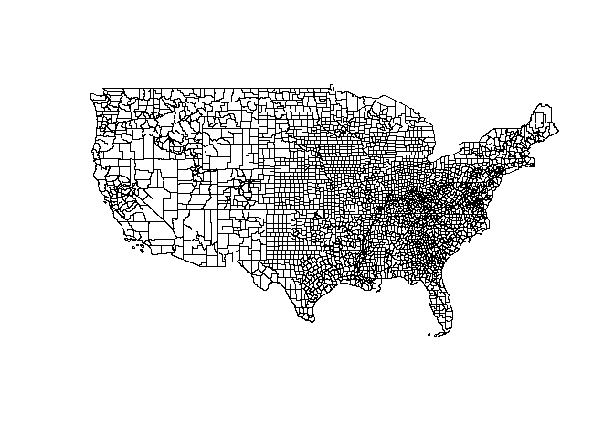

Census Data
================
Jake Hannan
September 21, 2019

### About the Census API

The US Census Bureau publishes a wealth of aggregated metrics for several geographic boundaries (e.g., zip codes, census block groups, census tracts) - this information can be used by anyone.

``` r
require(censusapi)
require(tigris)
require(plotly)
require(tidyverse)
require(spdplyr)
#get US Counties using `tigris`
us_counties <- counties(state = NULL)
#filter areas not interested via `spdplyr`
us_counties <- us_counties %>%
  filter(!STATEFP %in% c("02", "15", "66", "72", "69", "78", "60"))
#check our work!
plot(us_counties)
```



Nice! It looks like we've created the desired outcome so far: a map of US counties we wish to learn more about. Now that we have an SPDF, or SpatialPolygonsDataFrame, it's time to get some data to visualize.
